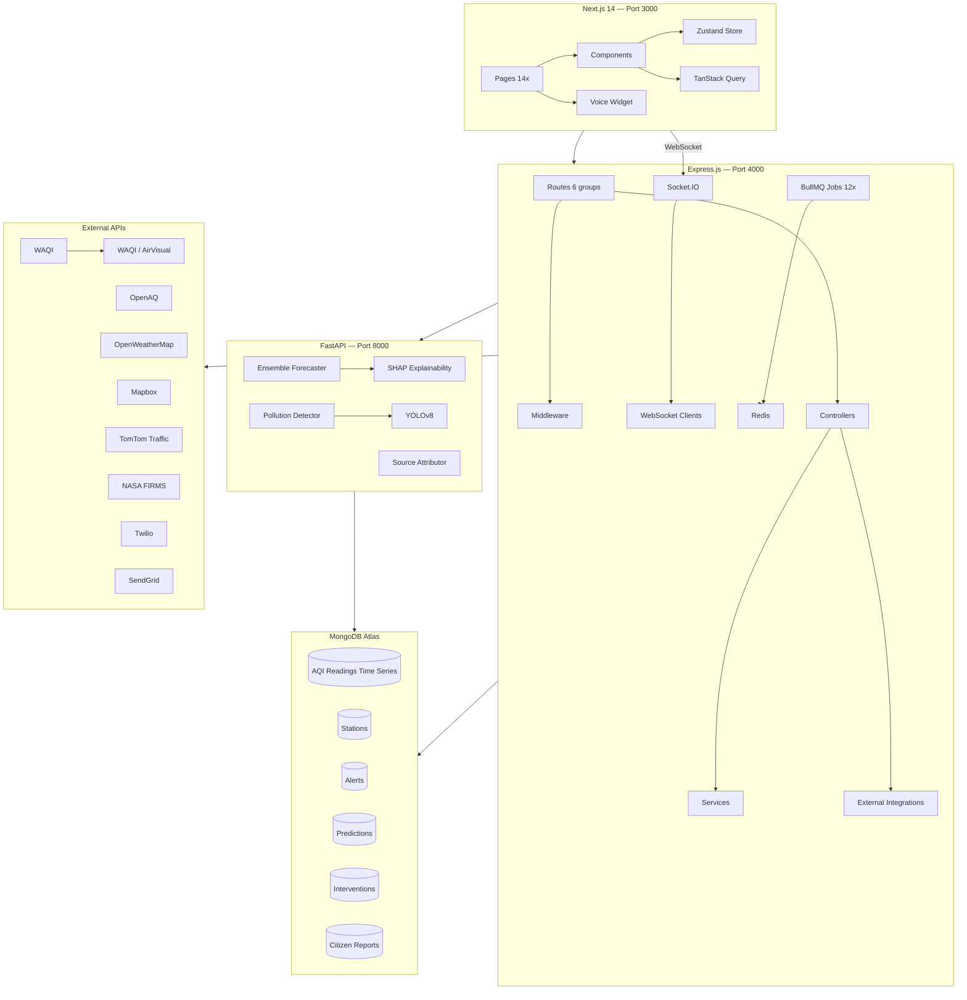

# 🌃 AI-Powered Urban Air Quality Intelligence Platform

> **Smart City Intervention System** — Ahmedabad, India  
> Real-time AQI monitoring, AI predictions, source attribution, and automated intervention recommendations.

## 🚀 Quick Start (5 minutes)

```bash
# 1. Clone and enter
git clone <repo>
cd smart-city-air-quality

# 2. Configure environment
cp .env.example .env
# Edit .env with your API keys (WAQI, Mapbox, etc.)

# 3. Launch everything
docker compose up -d

# 4. Open the dashboard
open http://localhost:3000
```

## 🏗️ Architecture



## 🎯 Features (14 Pages)

| Page | Route | Description |
|------|-------|-------------|
| **Home** | `/` | Live AQI hero card, 3D city background, 24h forecast strip, quick actions |
| **Monitor** | `/monitor` | Real-time sensor dashboard, live charts, station grid, WebSocket stream |
| **Map** | `/map` | Interactive Mapbox map, pollution heatmap, 12 toggleable layers, 3D buildings |
| **Predict** | `/predict` | AI forecasts (1h/24h/3d/7d), ensemble model, SHAP explanations, confidence intervals |
| **Alerts** | `/alerts` | Real-time alerts, severity cards, delivery channels, history, recommendations |
| **Interventions** | `/interventions` | Source attribution, AI-generated recommendations, intervention tracking |
| **Citizen** | `/citizen` | OTP login, report pollution (photo+location), green points, personalized health |
| **Health** | `/health` | AQI-health table, personal risk profiles, safe hours timeline, hospital risk |
| **Analytics** | `/analytics` | Historical trends, calendar heatmap, multi-pollutant charts, CSV/PDF export |
| **Sources** | `/sources` | Live source breakdown pie chart, contribution trends, reduction strategies |
| **Command** | `/command` | Admin dashboard, top 10 areas, one-click plans, effectiveness reports, audit log |
| **Open Data** | `/open-data` | Public API docs, CSV/GeoJSON downloads, embeddable widgets |
| **Camera** | `/camera` | YOLOv8 computer vision, smoke/dust/traffic detection from CCTV feeds |
| **Voice** | (floating) | Web Speech API voice assistant, multilingual, intent classification |

## 🛠️ Tech Stack

| Layer | Technology |
|-------|-----------|
| **Frontend** | Next.js 14, TypeScript, Tailwind CSS, Framer Motion, Three.js, Recharts, Mapbox GL |
| **Backend** | Express.js, Socket.IO, BullMQ, Mongoose, Redis, Pino |
| **ML/AI** | FastAPI, scikit-learn, XGBoost, LightGBM, SHAP, YOLOv8 |
| **Database** | MongoDB Atlas (Time Series), Redis |
| **Cloud** | Docker Compose, AWS S3, Firebase |

## 🔌 External APIs

- **WAQI** — Primary real-time AQI data
- **OpenAQ** — Cross-validation & global stations
- **OpenWeatherMap** — Weather forecasts & history
- **Mapbox** — Base maps, geocoding, isochrones
- **TomTom** — Real-time traffic flow data
- **NASA FIRMS** — Fire/stubble burning detection
- **Twilio / SendGrid / FCM** — Multi-channel alerting

## 📁 Project Structure

```
smart-city-air-quality/
├── frontend/          # Next.js 14 (14 pages, 30+ components)
├── backend/           # Express.js (6 route groups, 9 integrations, 12 jobs)
├── ml-service/        # FastAPI (forecaster, detector, attributor)
├── data-pipeline/     # ETL scripts & seed data
├── docs/              # Architecture, API, deployment docs
├── docker-compose.yml # One-command spin up
└── .env.example       # All required variables
```

## 📊 Data Ingestion Jobs

| Job | Interval | Description |
|-----|----------|-------------|
| INGEST-WAQI | 10 min | Real-time AQI from WAQI |
| INGEST-OPENAQ | 30 min | Cross-validation data |
| INGEST-CPCB | 60 min | Official India government data |
| INGEST-OPENWEATHER | 15 min | Weather conditions |
| GENERATE-PREDICTIONS | 30 min | ML forecast updates |
| ALERT-EVALUATOR | 1 min | Threshold breach detection |
| SOURCE-ATTRIBUTION | 1 hour | Pollution source breakdown |

## 🔐 Environment Variables

See `.env.example` for all 40+ configuration variables. Minimum required:
- `WAQI_TOKEN` — [Get free token](https://aqicn.org/data-platform/token/)
- `MAPBOX_TOKEN` — [Get free token](https://account.mapbox.com/)
- `OWM_API_KEY` — [Get free key](https://openweathermap.org/api)

## 👥 Roles

- **Citizen** — Report pollution, view AQI, subscribe to alerts
- **Operator** — Manage alerts, approve/reject interventions, dispatch resources
- **Admin** — Manage stations, users, API keys, view audit logs, trigger retraining

## 📄 License

MIT — Built for Smart City Ahmedabad Initiative
